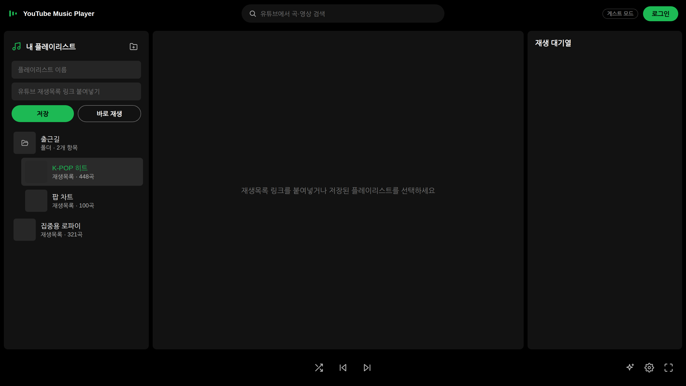

# YouTube Music Player

유튜브 재생목록 링크를 붙여넣어 음악과 영상을 감상하는 **무설치 Windows 데스크톱 플레이어**입니다.
유튜브 로그인이나 API 키 없이 동작하며, 미디어 파일을 내려받지 않고
재생목록 **링크만** 로컬에 저장·관리합니다.

## 📥 다운로드 (Windows)

### **[⬇ 최신 버전 내려받기 (ZIP)](https://github.com/Boo-seon-woong/youtube-playlist-randomizer/releases/latest/download/YouTube-Music-Player-windows-x64.zip)**

1. 내려받은 ZIP의 압축을 풉니다. **설치 과정이 없습니다** — 폴더째 아무 데나 두면 됩니다.
2. 폴더 안의 `YouTube Music Player.exe`를 실행합니다.
3. 처음 실행할 때 Windows SmartScreen 파란 경고가 뜨면 **추가 정보 → 실행**을 누르세요.
   (서명되지 않은 앱이라 표시되는 안내로, 앱은 유튜브 페이지 열람 외에 아무것도 내려받지 않습니다.)

전체 버전 목록은 [Releases](https://github.com/Boo-seon-woong/youtube-playlist-randomizer/releases) 페이지에 있습니다.

## 주요 기능

- **재생목록 링크 재생** — `youtube.com/playlist?list=...`, `watch?v=...&list=...` 링크나 재생목록 ID를 붙여넣으면 영상과 함께 재생
- **유튜브 검색** — 상단 검색창에서 곡·영상을 검색해 **지금 재생**, **대기열에 추가**, (로그인 시) **내 재생목록에 추가**
- **추천 곡** — 재생 바의 별 버튼으로 하단에 추천 패널을 열면, 지금 재생 중인 재생목록의 유튜브 **맞춤 동영상**(재생목록 페이지의 그 추천)을 보여줌. **새로고침** 버튼으로 다른 추천을 볼 수 있고, 카드에서 바로 재생·대기열 추가·내 재생목록 추가 가능 (맞춤 동영상은 로그인한 내 재생목록에서 제공)
- **구글 계정 연동 (선택)** — 기본은 로그인 없는 **게스트 모드**. **로그인** 버튼으로 구글 계정에 로그인하면 사이드바 맨 위에 **내 YouTube 플레이리스트** 섹션이 생겨 계정의 재생목록(비공개·나중에 볼 동영상 포함)을 바로 재생할 수 있고, 검색 결과를 계정 재생목록에 추가할 수 있음. 게스트 모드에서 저장한 로컬 목록은 로그인 후에도 그대로 유지
- **전곡 로드 + 즉시 재생** — 첫 곡들을 받는 즉시 재생·셔플을 시작하고, 수백 곡짜리 재생목록의 나머지는 백그라운드로 이어서 불러옴 (200곡 제한 없음)
- **셔플 재생** — 재생목록을 섞어서 시작하거나, 재생 중에는 현재 곡을 유지한 채 나머지만 다시 섞기
- **재생 대기열** — 순번·썸네일·곡 제목·아티스트 표시, 현재 곡 하이라이트, 곡 클릭으로 즉시 이동, 곡별 삭제
- **플레이리스트 저장** — 자주 듣는 재생목록에 이름을 붙여 저장. 목록을 클릭하면 바로 재생되지 않고 **중앙에 곡 구성**(썸네일·제목·아티스트)이 표시되며, 그 화면의 **재생 / 셔플 재생** 버튼(또는 특정 곡 클릭)으로 재생을 시작 — 재생 중인 대기열(셔플 순서 포함)은 다른 재생목록을 살펴봐도 그대로 유지
- **폴더 정리** — Windows 탐색기처럼 드래그로 정리. 행의 **위/아래 가장자리에 놓으면 순서 이동**(삽입선 표시), 재생목록을 다른 재생목록 **가운데에 완전히 겹치면 폴더로 묶임**. 폴더 위에 겹치면 그 안으로 들어가 **폴더 안 폴더**(중첩 제한 없음)도 가능, 빈 공간에 놓으면 폴더 밖으로. **우클릭 메뉴로 원하는 위치에 새 폴더**를 바로 만들 수 있음 (폴더 위 우클릭 → 그 폴더 안에, 재생목록 위 우클릭 → 같은 위치에)
- **이름·링크 수정** — 연필 버튼으로 저장된 재생목록의 이름과 링크, 폴더 이름을 언제든 수정
- **재생목록 썸네일** — 각 재생목록에 첫 영상 썸네일과 곡 수 배지를 표시 (자동 수집·캐시)
- **임베드 차단 곡도 재생** — 외부 재생이 차단된 곡은 자동으로 유튜브 페이지 직접 재생으로 전환 (대기열에 "직접 재생" 배지 표시). 버퍼링에서 멈춰 아예 시작되지 않는 곡도 15초 후 자동으로 직접 재생으로 전환
- **광고 처리** — 광고 도메인 차단(플레이어 화면) + 직접 재생 모드의 영상 광고 자동 스킵. "광고 차단 프로그램은 허용되지 않습니다" 팝업이 떠도 자동으로 닫고 재생을 이어감
- **몰입 모드** — 재생 바의 **전체화면** 버튼 또는 **F 키**로 켜고 끄는 앱 자체 전체화면. 일반 재생·직접 재생 구분 없이 화면을 꽉 채우고 곡 전환 시에도 끊기지 않으며, 마우스를 멈추면 해제 버튼이 자동으로 숨겨짐
- **자동 진행** — 곡이 끝나면 다음 곡, 마지막 곡 이후 처음부터 반복. 재생 불가 곡(삭제/비공개)은 표시 후 자동 스킵
- **마스터 볼륨** — 하단 재생 바의 볼륨 슬라이더 하나로 일반 재생·직접 재생의 볼륨을 통일 (유튜브 쪽 볼륨이 모드마다 따로 놀지 않음). 스피커 버튼을 누르면 열리는 **사운드 세팅**에서 소숫점 둘째자리까지 직접 입력해 정밀 조절 가능, 값은 자동 저장되어 다음 실행에도 유지
- **가사 플로팅 창** — 재생 바의 책 버튼으로 Lyrs 스타일의 항상 위 가사 창을 열 수 있음. 현재 곡을 자동 인식해 **ALSong DB의 한글·번역 가사를 우선** 표시하고, 한글 가사가 없을 때만 LRCLIB 원어 가사로 보완하며 "한글 번역 없음 · 원어 가사"를 표시. 창은 투명 배경 위에 앨범 이미지와 줄마다 칩 배경을 두른 가사(원문·발음·번역)를 띄우는 디자인으로, 드래그로 이동·위치 저장. 재생바를 클릭하면 그 지점으로 이동하고, 스피커 버튼으로 앱 볼륨도 조절할 수 있음. 창을 드래그해 옮기는 동안에만 잡을 수 있는 영역의 테두리가 표시됨. 왼쪽 사각형은 앨범 이미지 대신 **영상 작게 표시**(음소거 미러)로 바꿀 수 있음. 게임 위에 띄울 때는 **클릭 통과(잠금)** 모드를 켜면 가사 창을 눌러도 그 아래 프로그램이 클릭을 받아 조준이 방해받지 않음. 전역 단축키로 게임 중에도 창 전환 없이 조작 가능 — **Alt+1/Alt+2**(볼륨 감소/증가), **Alt+3**(가사 창 표시/숨기기), **Alt+4**(클릭 통과), **Alt+5**(작업 표시줄 같은 다른 항상-위 창에 가렸을 때 다시 맨 위로). 크기(슬라이더·직접 입력), 가사 배경 불투명도, 인터페이스 불투명도, 글씨 크기, 재생바·곡 정보·상태 문구, 재생/볼륨 컨트롤 버튼, 항상 위 표시는 **디자인 설정 패널을 아래로 스크롤**하면 나오는 섹션에서 조절 (가사 창의 톱니 버튼이 바로 그 위치를 엶)
- **가사 보기** — 가사 버튼 옆의 버튼을 누르면 재생 중인 영상 위에 전체 가사가 오른쪽에 세로로 펼쳐지고, 현재 줄이 밝게 강조되며 화면 중앙으로 자동 이동 (먼 줄은 옅고 흐리게). 전체화면에서도 그대로 유지되고, 이때는 왼쪽 아래에 곡 정보와 이전/일시정지/다음 컨트롤이 함께 표시
- **전용 재생바** — 하단 바의 재생바를 클릭하거나 끌어 재생 지점을 옮길 수 있고, 재생/일시정지 버튼도 하단에 있음. 지점을 옮기는 동안에는 화면이 앨범 아트로 잠깐 덮여, 유튜브가 순간적으로 띄우는 자체 UI가 보이지 않음. 중앙 영상 영역은 마우스 상호작용을 막아 유튜브 자체 UI(컨트롤 바·일시정지 오버레이 등)가 뜨지 않음
- **최소화해도 계속 재생** — 창을 최소화하거나 다른 프로그램에 가려도 곡이 멈추지 않음 (크로미움의 백그라운드 절전 동작을 꺼서 곡 종료 감지·광고 스킵 타이머가 계속 돌게 함)
- **패널 접기·폭 조절** — 왼쪽 '내 플레이리스트'와 오른쪽 '재생 대기열'은 패널 사이 경계를 드래그해 폭을 바꾸고, 경계 가운데의 ‹ › 버튼으로 접었다 펼칠 수 있음. 드래그로 충분히 좁히면 **썸네일만 남는 좁은 목록**으로 바뀌고(스포티파이식), 다시 넓게 끌면 원래대로 돌아옴. 가운데 영상도 하단 바의 **최소화** 버튼으로 화면 구성에서 숨겨 목록을 넓게 볼 수 있음 (재생은 그대로 이어지고, 폭·접힘·최소화 상태는 자동 저장)
- **디자인 테마** — 하단 톱니 버튼에서 테마 프리셋 6종을 고르거나 포인트·배경·패널 색을 직접 지정 (선택은 자동 저장되어 다음 실행에도 유지)

## 사용법

1. 왼쪽 입력창에 유튜브 재생목록 링크를 붙여넣고 **바로 재생**을 누르면 즉시 재생됩니다.
2. 이름을 함께 입력하고 **저장**하면 왼쪽 목록에 등록됩니다. 목록을 **클릭하면 중앙에 곡 구성**이 나타나고(재생은 아직 시작되지 않음), **재생 / 셔플 재생** 버튼이나 원하는 곡을 클릭하면 그때 재생이 시작되며 중앙이 영상으로 바뀝니다. 지금 듣고 있는 대기열은 다른 재생목록을 살펴보는 동안 그대로 유지됩니다. 행에 마우스를 올리면 나오는 **재생 / 셔플** 아이콘이나 우클릭 메뉴로는 곡 구성을 거치지 않고 바로 재생할 수도 있습니다.
3. 상단 **검색창**에 곡·영상 이름을 입력하면 결과가 플레이어 위에 표시됩니다. 곡을 클릭하면 바로 재생되고, 행의 버튼으로 **대기열에 추가**하거나 (로그인 시) **내 재생목록에 추가**할 수 있습니다. Esc나 ✕로 닫습니다.
4. 상단 오른쪽 **로그인** 버튼으로 구글 계정에 로그인하면 (선택 사항):
   - 사이드바 맨 위에 **내 YouTube 플레이리스트** 섹션이 생기고, 계정의 재생목록을 클릭 한 번으로 재생/셔플할 수 있습니다 (비공개·나중에 볼 동영상 포함).
   - 게스트 모드에서 저장한 로컬 목록은 그 아래에 그대로 유지됩니다.
   - 상단의 계정 이름 버튼(또는 계정 섹션 우클릭)에서 **새로고침 / 로그아웃**할 수 있습니다.
5. 왼쪽 목록 정리:
   - 행의 **위/아래 가장자리**에 드래그해 놓으면 그 위치로 **순서만 이동**합니다 (초록 삽입선 표시).
   - 재생목록을 다른 재생목록 **가운데**에 완전히 겹쳐 놓으면 **폴더**로 묶입니다 (바로 이름 입력).
   - 재생목록이나 폴더를 다른 폴더 가운데에 겹치면 그 안으로 들어갑니다 — **폴더 안에 폴더**를 만들 수 있습니다. 목록의 빈 공간에 놓으면 폴더 밖으로 나옵니다.
   - **우클릭 메뉴**로 원하는 위치에 새 폴더를 만들거나 재생·셔플·수정·삭제를 실행합니다. 폴더 위에서 우클릭하면 그 폴더 안에, 재생목록 위에서 우클릭하면 같은 위치에 폴더가 생깁니다.
   - 폴더를 클릭하면 접거나 펼칩니다. 연필 버튼으로 이름·링크를 수정합니다.
   - 폴더를 삭제해도 안의 항목은 지워지지 않고 한 단계 밖으로 이동합니다.
   - 사이드바와 플레이어 사이 경계를 **드래그하면 폭이 바뀌고**, 경계 가운데의 **‹ 버튼**을 누르면 사이드바가 접힙니다 (다시 누르면 펼침). 오른쪽 대기열도 같은 방식입니다.
   - 하단 재생 바의 **최소화 버튼**을 누르면 가운데 영상이 화면 구성에서 사라지고 목록이 그 자리를 채웁니다 (소리는 계속). 최소화 버튼을 다시 누르면 돌아오며, 곡 구성·검색을 열거나 전체화면에 들어가도 자동으로 다시 나타납니다. 최소화 중에는 사이드바 행의 **재생 / 셔플** 버튼으로 재생목록을 바로 틀 수 있습니다.
4. 오른쪽 대기열에서:
   - 곡을 클릭하면 해당 곡으로 이동합니다.
   - 휴지통 버튼으로 이번 감상에서 곡을 뺄 수 있습니다 (저장된 재생목록은 바뀌지 않음).
   - 하단 재생 바에 현재 곡의 썸네일·제목·아티스트가 표시되고, **셔플 / 이전 / 다음** 버튼으로 재생을 제어합니다.
   - 오른쪽의 **볼륨 슬라이더**가 앱 전체 볼륨입니다 — 일반 재생·직접 재생 모두 이 값 하나로 통일됩니다. **스피커 버튼**을 누르면 사운드 세팅이 열리고, 소숫점 둘째자리까지(예: 37.25) 직접 입력해 정밀하게 맞출 수 있습니다.
5. 하단 재생 바의 **가사 버튼(책 아이콘)**을 누르면 현재 곡의 가사 플로팅 창이 열립니다. 창을 드래그해 위치를 옮길 수 있으며, 마우스를 올리면 나타나는 검색 버튼으로 다른 ALSong/LRCLIB 결과를 선택할 수 있고, 가사가 원어로만 제공되면 안내가 표시됩니다. 재생바를 클릭하면 그 지점으로 이동하고, 스피커 버튼으로 볼륨을 조절합니다. 창 크기·불투명도·글씨 크기·재생바·재생 제어 버튼 등의 표시 여부는 디자인 설정 패널을 아래로 스크롤하면 나오는 **플로팅 가사 창** 섹션에서 조절합니다 (가사 창의 톱니 버튼을 눌러도 열림). 그 옆의 **가사 보기** 버튼은 영상 위에 전체 가사를 펼쳐 현재 줄을 따라가며 보여줍니다 — 전체화면 감상과 함께 쓰기 좋습니다.
6. 하단 재생 바의 **톱니 버튼**으로 디자인 설정을 엽니다. 테마 프리셋을 고르거나 포인트/배경/패널 색을 직접 지정할 수 있고, 언제든 기본 테마로 되돌릴 수 있습니다.
7. 하단 재생 바의 **전체화면** 버튼이나 **F 키**로 전체화면 감상을 시작합니다. 곡이 전환돼도(직접 재생 포함) 유지되며, **F/Esc** 또는 우상단 버튼으로 해제합니다. 우상단 해제 버튼은 마우스를 잠시 멈추면 사라지고 다시 움직이면 나타납니다.

## 알아두기

- "직접 재생" 배지가 붙은 곡은 실제 유튜브 페이지로 재생됩니다. 광고가 감지되면 무음·화면 숨김 상태로 빠르게 건너뛰므로 잠깐 검은 화면이 보일 수 있습니다.
- 회색 취소선으로 표시되는 곡은 삭제되었거나 비공개라 재생할 수 없는 곡입니다.
- 저장한 플레이리스트는 `%APPDATA%\YouTube Music Player\playlists.json`에 보관됩니다. 앱 폴더를 지워도 유지됩니다.

## 개발자 문서

일반 사용자는 위의 다운로드만으로 충분합니다. 소스에서 직접 실행하거나 빌드하려면:

- [빌드 및 패키징](docs/DEVELOPMENT.md)
- [아키텍처 및 기술 노트](docs/ARCHITECTURE.md)
