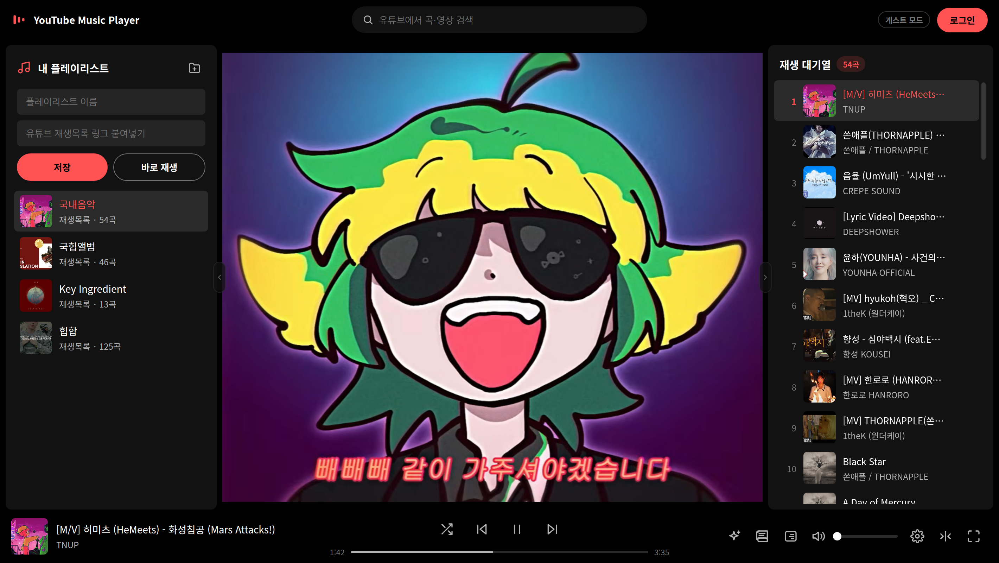
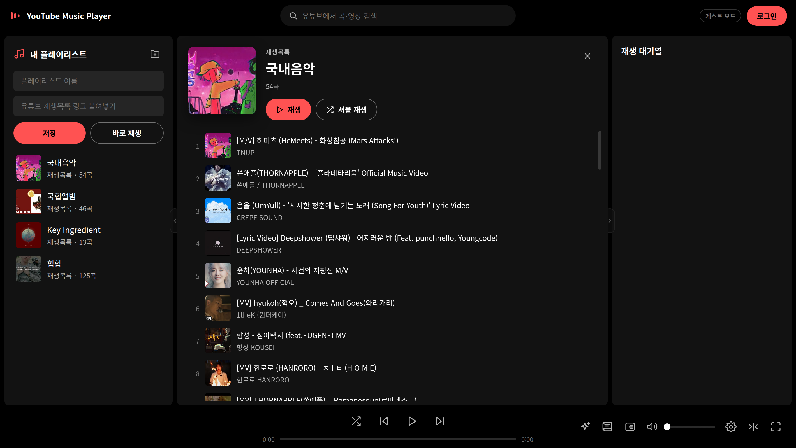
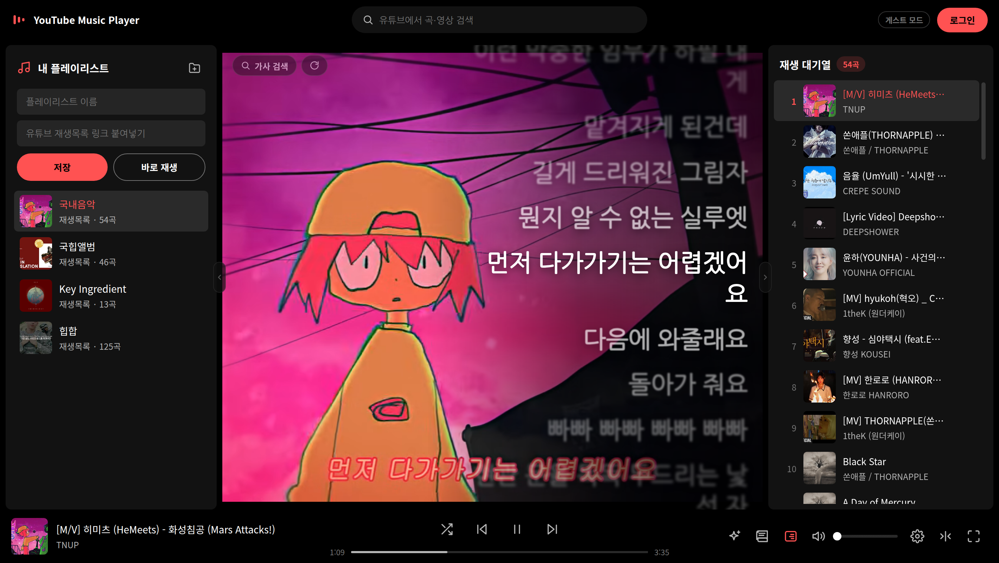
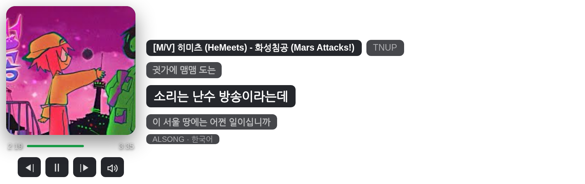
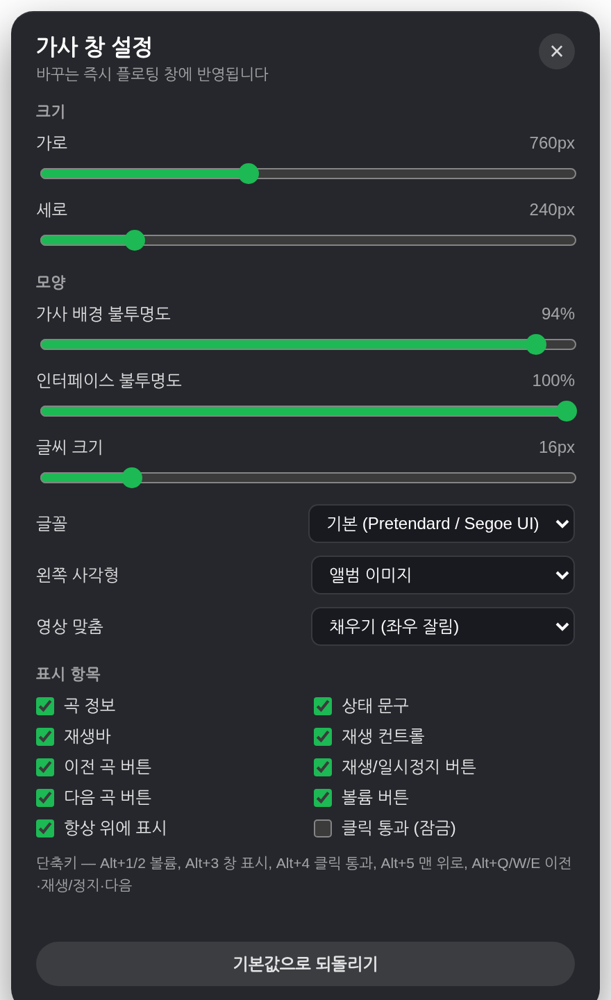
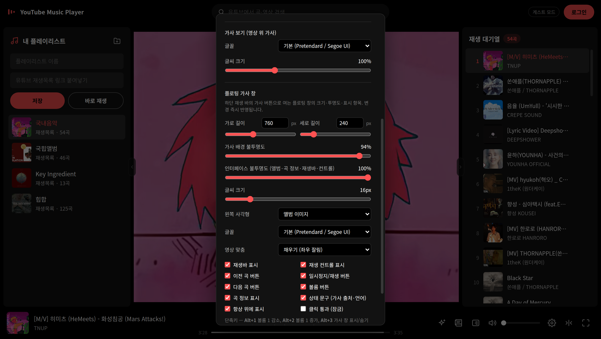
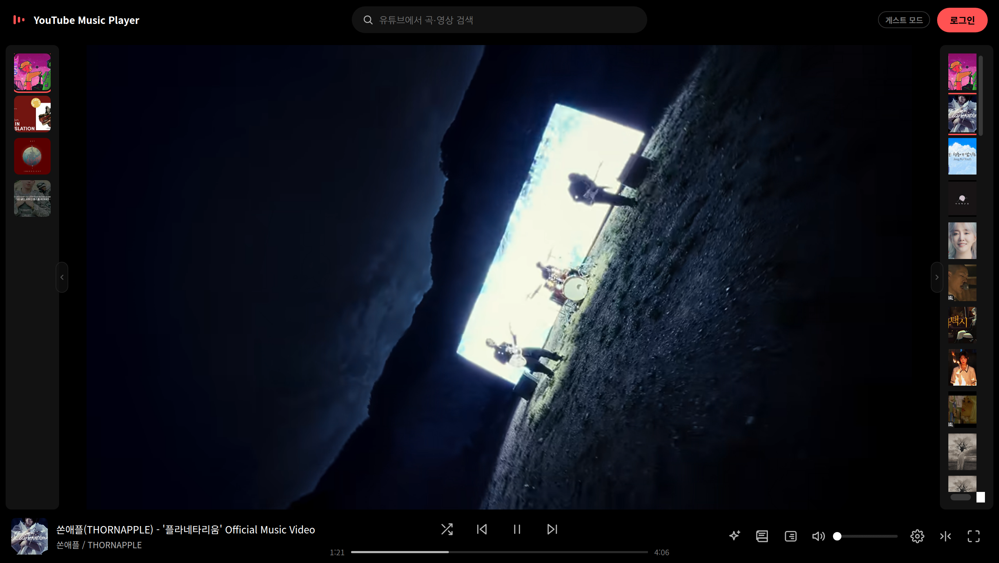

# YouTube Music Player

유튜브 재생목록 링크를 붙여넣어 음악과 영상을 감상하는 **무설치 Windows 데스크톱 플레이어**입니다.
유튜브 로그인이나 API 키 없이 동작하며, 미디어 파일을 내려받지 않고
재생목록 **링크만** 로컬에 저장·관리합니다.

## 📥 다운로드 (Windows)

### **[⬇ 최신 버전 내려받기 (ZIP)](https://github.com/Boo-seon-woong/youtube-playlist-randomizer/releases/latest/download/YouTube-Music-Player-windows-x64.zip)**

1. 내려받은 ZIP의 압축을 풉니다 (내장 번역 모델 동봉으로 용량이 큽니다). **설치 과정이 없습니다** — 폴더째 아무 데나 두면 됩니다.
2. 폴더 안의 `YouTube Music Player.exe`를 실행합니다.
3. 처음 실행할 때 Windows SmartScreen 파란 경고가 뜨면 **추가 정보 → 실행**을 누르세요.
   (서명되지 않은 앱이라 표시되는 안내로, 앱은 유튜브 페이지 열람 외에 아무것도 내려받지 않습니다.)

전체 버전 목록은 [Releases](https://github.com/Boo-seon-woong/youtube-playlist-randomizer/releases) 페이지에 있습니다.

## 한눈에 보기

| | |
|---|---|
|  |  |
| **곡 구성 보기** — 재생목록을 누르면 바로 틀지 않고 곡 목록을 먼저 보여줍니다. 지금 듣는 대기열은 그대로. | **가사 보기** — 영상 위에 전체 가사가 펼쳐지고 현재 줄을 따라 자동으로 이동합니다. |
|  |  |
| **플로팅 가사 창** — 투명 배경 위에 앨범 이미지(또는 작은 영상)와 한글·발음·번역 가사. 게임 위에 띄워도 클릭이 통과합니다. | **가사 창 설정 팝업** — 크기·불투명도·글꼴·표시 항목을 바꾸는 즉시 반영됩니다. |
|  |  |
| **디자인 설정** — 테마 6종·색 직접 지정, 가사 보기 글꼴/크기, 플로팅 창 설정. | **반 최소화** — 패널을 좁게 끌면 썸네일 타일만 남습니다. 가운데 영상도 접을 수 있습니다. |

## 주요 기능

### 재생
- **재생목록 링크 재생** — `youtube.com/playlist?list=...`, `watch?v=...&list=...` 링크나 재생목록 ID를 붙여넣으면 영상과 함께 재생
- **전곡 로드 + 즉시 재생** — 첫 곡들을 받는 즉시 재생·셔플을 시작하고 나머지는 백그라운드로 이어 받음 (200곡 제한 없음). 재생목록에 실제로 있는 곡만 정확히 가져옴
- **셔플 재생** — 섞어서 시작하거나, 재생 중엔 현재 곡을 유지한 채 나머지만 다시 섞기
- **재생 대기열** — 순번·썸네일·제목·아티스트, 현재 곡 하이라이트, 클릭으로 이동, 곡별 삭제
- **전용 재생바** — 하단 재생바를 클릭하거나 끌어 재생 지점 이동, 재생/일시정지·이전·다음 버튼. 중앙 영상 영역은 마우스 상호작용을 막아 유튜브 자체 UI(제목줄·"동영상 더보기"·공유 등)가 뜨지 않음
- **마스터 볼륨** — 슬라이더 하나로 일반 재생·직접 재생 볼륨을 통일. 사운드 세팅에서 소숫점 둘째자리까지 직접 입력
- **임베드 차단 곡도 재생** — 외부 재생이 차단된 곡은 유튜브 페이지 직접 재생으로 자동 전환 ("직접 재생" 배지)
- **광고 처리** — 광고 도메인 차단 + 직접 재생의 영상 광고 자동 스킵. **실제 음악이 재생 중일 때만 소리를 내므로** 광고·로딩 구간은 완전히 조용함
- **최소화해도 계속 재생** — 창을 최소화하거나 다른 프로그램에 가려도 곡이 멈추지 않음
- **몰입 모드** — 전체화면 버튼 또는 **F 키**. 곡 전환에도 유지되고, 마우스를 멈추면 해제 버튼이 숨겨짐

### 가사
- **자동 가사** — 현재 곡을 인식해 **ALSong의 한글·발음·번역 가사**를 우선 표시, 없으면 LRCLIB 원어 가사. 제목·아티스트가 확실히 일치할 때만 채택해 엉뚱한 곡의 가사를 보여주지 않음
- **내장 기계 번역** — 한국어 가사가 없는 곡은 **앱에 동봉된 번역 모델**(오프라인, 외부 전송 없음)이 각 줄 아래에 한국어를 병기. 백그라운드로 진행되며 곡별로 저장돼 다음 재생부터는 즉시 표시 (설정에서 끌 수 있음)
- **가사 보기** — 영상 위에 전체 가사를 오른쪽에 펼치고 현재 줄을 밝게 강조·중앙 정렬. 글꼴(7종)과 크기는 디자인 설정에서
- **가사 검색** — 가사 보기의 **가사 검색** 버튼이나 플로팅 창의 검색 버튼으로 다른 ALSong/LRCLIB 결과를 골라 적용
- **플로팅 가사 창** — 항상 위에 뜨는 투명 창. 앨범 이미지 또는 **영상 작게 표시**(음소거 미러), 곡 정보, 재생바(클릭 이동), 이전/재생/다음·볼륨 버튼. 마우스는 앨범·재생바·버튼 위에서만 반응하고 나머지는 아래 창으로 통과
- **게임과 함께** — **클릭 통과(잠금)** 모드로 조준이 가사 창에 걸리지 않음. 전역 단축키로 게임 화면을 떠나지 않고 조작: **Alt+1/2** 볼륨, **Alt+3** 가사 창 표시/숨김, **Alt+4** 클릭 통과, **Alt+5** 다른 창에 가렸을 때 다시 맨 위로, **Alt+Q/W/E** 이전 곡·재생/일시정지·다음 곡

### 정리·탐색
- **유튜브 검색** — 상단 검색창에서 곡·영상을 검색해 지금 재생 / 대기열 추가 / (로그인 시) 내 재생목록 추가
- **추천 곡** — 재생 중인 재생목록의 유튜브 **맞춤 동영상**을 하단 패널로 (로그인한 내 재생목록에서 제공)
- **구글 계정 연동 (선택)** — 로그인하면 사이드바 위에 **내 YouTube 플레이리스트** 섹션(접힌 채 시작). 비공개·나중에 볼 동영상도 재생
- **플레이리스트 저장·폴더 정리** — 탐색기처럼 드래그로 순서 이동·폴더 묶기·폴더 안 폴더, 우클릭 메뉴로 새 폴더·수정·삭제
- **패널 접기·폭 조절·반 최소화** — 경계를 드래그해 폭 조절, ‹ › 버튼으로 접기, 충분히 좁히면 썸네일만 남는 레일 모드. 가운데 영상도 하단 최소화 버튼으로 접기
- **디자인 테마** — 프리셋 6종 또는 포인트·배경·패널 색 직접 지정. 모든 설정은 자동 저장

## 사용법

1. 왼쪽 입력창에 유튜브 재생목록 링크를 붙여넣고 **바로 재생**을 누르면 즉시 재생됩니다.
2. 이름을 함께 입력하고 **저장**하면 왼쪽 목록에 등록됩니다. 목록을 **클릭하면 중앙에 곡 구성**이 나타나고, **재생 / 셔플 재생** 버튼이나 원하는 곡을 클릭하면 그때 재생이 시작됩니다. 행에 마우스를 올리면 나오는 **재생 / 셔플** 아이콘이나 우클릭 메뉴로는 바로 재생할 수도 있습니다.
3. 상단 **검색창**에 곡·영상 이름을 입력하면 결과가 플레이어 위에 표시됩니다. 곡을 클릭하면 바로 재생되고, 행의 버튼으로 **대기열에 추가**하거나 (로그인 시) **내 재생목록에 추가**할 수 있습니다.
4. 상단 오른쪽 **로그인** 버튼으로 구글 계정에 로그인하면 (선택 사항) 사이드바 맨 위에 **내 YouTube 플레이리스트** 섹션이 생깁니다. 게스트 모드에서 저장한 로컬 목록은 그대로 유지됩니다.
5. 왼쪽 목록 정리: 행의 **위/아래 가장자리**에 놓으면 순서 이동, 다른 재생목록 **가운데**에 겹치면 폴더로 묶임, 폴더 가운데에 겹치면 그 안으로. **우클릭 메뉴**로 새 폴더·재생·셔플·수정·삭제. 패널 경계를 **드래그**해 폭을 바꾸고, 충분히 좁히면 썸네일만 남는 **반 최소화**가 됩니다.
6. 하단 재생 바: 썸네일·제목·아티스트, **셔플 / 이전 / 재생·일시정지 / 다음**, 재생 지점을 옮기는 **재생바**, 앱 전체 **볼륨 슬라이더**(스피커 버튼 → 사운드 세팅에서 소숫점 입력).
7. **가사 버튼(책 아이콘)**으로 플로팅 가사 창을 엽니다. 앨범 이미지를 잡고 드래그해 옮기고, 마우스를 올리면 나오는 버튼으로 검색·다시 찾기·설정·숨기기를 합니다. 톱니 버튼은 플로팅 창 옆에 **설정 팝업**을 띄웁니다. 그 옆의 **가사 보기** 버튼은 영상 위에 전체 가사를 펼치며, 왼쪽 위 **가사 검색**으로 다른 가사를 고를 수 있습니다.
8. **톱니 버튼**으로 디자인 설정을 엽니다. 테마·색, 가사 보기 글꼴/크기, 플로팅 가사 창 설정이 한 패널에 있습니다.
9. **전체화면** 버튼이나 **F 키**로 몰입 모드를 켜고, **F/Esc** 또는 우상단 버튼으로 해제합니다.

## 알아두기

- "직접 재생" 배지가 붙은 곡은 실제 유튜브 페이지로 재생됩니다. 광고가 감지되면 화면을 숨기고 빠르게 건너뛰며, 그동안 소리는 나지 않습니다.
- 회색 취소선으로 표시되는 곡은 삭제되었거나 비공개라 재생할 수 없는 곡입니다.
- 플로팅 가사 창의 **영상 작게 표시**는 임베드가 가능한 곡에서만 동작하고, 직접 재생 곡은 앨범 이미지로 표시됩니다.
- 가사 글꼴은 웹폰트(Google Fonts)라 오프라인이면 기본 글꼴로 표시됩니다.
- 저장한 플레이리스트와 설정은 `%APPDATA%\YouTube Music Player\`에 보관됩니다. 앱 폴더를 지워도 유지됩니다.

## 개발자 문서

- [빌드 및 패키징](docs/DEVELOPMENT.md)
- [아키텍처 및 기술 노트](docs/ARCHITECTURE.md)
